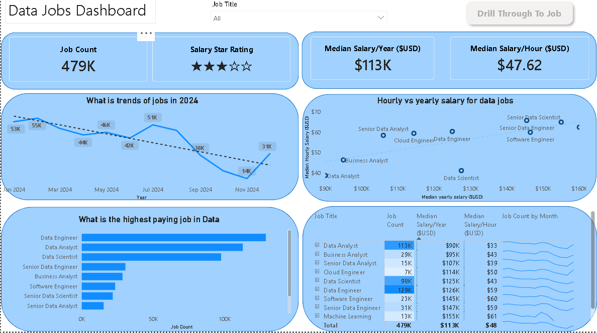

# Data Jobs Dashboard with Power Bi

## Introduction

This dashboard was created for **Job Seekers, Job Transitioners, and Job Swappers** to solve a common problem: information about the job market is scattered and hard to grasp. Using a *real-world dataset of 2024 data science job postings* (including titles, salaries, and locations), this project provides a single, easy-to-use interface to explore market trends and compensation. 

## Skills Showcased

- **Data Transformation (ETL) with Power Query:**
Cleaned, shaped, and prepared raw data for analysis. 
- **Core Charts:** Utilized **Column, Bar, Line,** and **Area Charts** to compare job counts and track trends over time. 
-**KPI Indicators and Tables:** Used **Cards** to display key metrics and **Tables** to provide sortable data.
- **Dashboard Design:** Designed an intuitive and visually appealing layout, exploring both common/uncommon charts types to best tell the data story.
- **Interactive Reporting:** 
- **Slicers:** To dynamically filter the report by job title.
- **Buttons and Bookmarks:** To create seamless navigatino experience
- **Drill-Through:** to navigate from high-level summary to detailed view

## Dashboard Overview
### Page 1: High-Level Market View

Showcases key KPIs like total job count, median salaries, and top job titles to give you a quick understandinig of what's happening in the job market at a glance. 

### Page 2: Job Title Drill Through

This is the deep-dive page. From the main dashboard, you can drill through to this view to get specific details for a single job title, including salary ranges, work-from-home stats, top hiring platforms, and a global map of job locations.

## Conclusions

This dashboard showcases how power BI can transform raw job posting data into a powerful tool for career analysts. It allows users to slice, filter, and drill through data to make informed decisions about their career path. 